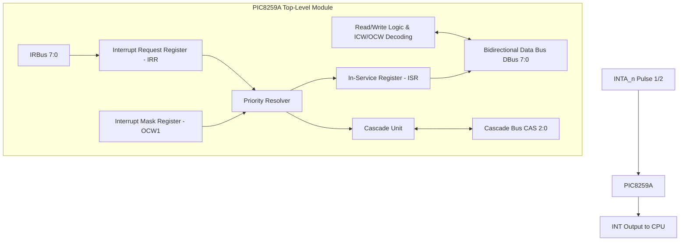

# Intel 8259A Programmable Interrupt Controller (PIC) - Verilog Implementation

[](https://en.wikipedia.org/wiki/Verilog)
[](http://iverilog.icarus.com/)
[](LICENSE)
[](#simulation--verification)

A robust, synthesizable, cycle-accurate Verilog-2005 implementation of the classic **Intel 8259A Programmable Interrupt Controller (PIC)** featuring complete Master/Slave **cascading support**, edge/level triggering, configurable priority resolution, 2-pulse `INTA` handshake, and full ICW/OCW command register processing.

---

## 🌟 Key Features

- **Full Master/Slave Cascading**: Supports connecting up to 8 Slave controllers to 1 Master controller via 3-bit `CAS[2:0]` bus (handling up to 64 vectored hardware interrupts).
- **Flexible Priority Resolver**:
  - **Fully Nested Mode**: Priority IR0 (highest) to IR7 (lowest).
  - **Auto-Rotating Priority Mode**: Priority rotates dynamically after interrupt servicing.
- **Dual Trigger Modes**: Edge-triggered (0 -> 1 transition) and Level-triggered interrupt requests via ICW1 `LTIM`.
- **Complete ICW/OCW Register Map**:
  - **Initialization Command Words**: `ICW1`, `ICW2`, `ICW3` (Master/Slave map), and `ICW4` (8086 mode, Auto-EOI).
  - **Operation Control Words**: `OCW1` (Interrupt Mask Register - IMR), `OCW2` (EOI commands), and `OCW3` (Status Read for IRR/ISR).
- **2-Pulse `INTA` Handshake**: Freeze & latch phase (Pulse 1) + 8-bit vector address byte drive phase (Pulse 2).
- **Fully Verified**: Includes 7 self-checking testbenches and automated Python/PowerShell/Bash regression runners.

---

## 🏗️ Architecture & Block Diagram



---

## 📁 Repository Structure

```
PIC8259A/
├── rtl/                        # Synthesizable RTL Modules
│   ├── PIC8259A.v              # Top-Level Integrated 8259A PIC Controller
│   ├── IRR.v                   # Interrupt Request Register (Edge & Level Mode)
│   ├── ISR.v                   # In-Service Register & Vector Calculation
│   ├── PriorityResolver.v      # Fully Nested & Auto-Rotating Priority Resolver
│   ├── RWLogic.v               # Read/Write Register Interface (ICW1-4, OCW1-3)
│   └── CascadeModule.v         # Master/Slave Cascade Unit & CAS Bus Driver
├── tb/                         # Self-Checking Verification Testbenches
│   ├── tb_IRR.v                # Unit testbench for IRR module
│   ├── tb_ISR.v                # Unit testbench for ISR module
│   ├── tb_PriorityResolver.v   # Unit testbench for Priority Resolver
│   ├── tb_RWLogic.v            # Unit testbench for RWLogic decoding
│   ├── tb_CascadeModule.v      # Unit testbench for Cascade Unit
│   ├── tb_PIC8259A_single.v    # Integration testbench for Single PIC
│   └── tb_PIC8259A_cascade.v   # System testbench for 1 Master + 1 Slave System
├── sim/                        # Simulation & Regression Automation
│   ├── run_tests.py            # Python Automated Regression Runner
│   ├── run_sim.ps1             # PowerShell Test Runner
│   └── run_sim.sh              # Bash Test Runner
├── docs/                       # Detailed Architecture & Technical Notes
│   └── architecture.md         # Signal timing charts & module specifications
├── .gitignore                  # Git ignore rules for simulation outputs
├── LICENSE                     # Open-source MIT License
└── README.md                   # Project Documentation
```

---

## 🧪 Simulation & Verification

The project is tested using **Icarus Verilog** (`iverilog`) and **VVP**. All testbenches are self-checking and output structured pass/fail results.

### Summary of Test Results

| Testbench Module | Type | Description | Result |
| :--- | :--- | :--- | :---: |
| `tb_IRR` | Unit | Edge/Level latching & INTA clear | `PASS` ✅ |
| `tb_ISR` | Unit | Vector calculation & EOI clear | `PASS` ✅ |
| `tb_PriorityResolver` | Unit | Fully nested, masking & auto-rotate | `PASS` ✅ |
| `tb_RWLogic` | Unit | ICW1-4 sequence & OCW1-3 decoding | `PASS` ✅ |
| `tb_CascadeModule` | Unit | Master/Slave CAS bus arbitration | `PASS` ✅ |
| `tb_PIC8259A_single` | Integration | End-to-end Single PIC lifecycle | `PASS` ✅ |
| `tb_PIC8259A_cascade` | System | Cascaded Master + Slave 2 system | `PASS` ✅ |

### Running the Tests

#### 1. Python Automated Runner (Cross-Platform)
```bash
python sim/run_tests.py
```

#### 2. Windows (PowerShell)
```powershell
.\sim\run_sim.ps1
```

#### 3. Linux / macOS (Bash)
```bash
chmod +x sim/run_sim.sh
./sim/run_sim.sh
```

#### 4. Viewing Waveforms with GTKWave
All testbenches generate `.vcd` waveform files for inspection:
```bash
gtkwave tb_PIC8259A_cascade.vcd
```

---

## 📜 License

Distributed under the **MIT License**. See `LICENSE` for more information.
